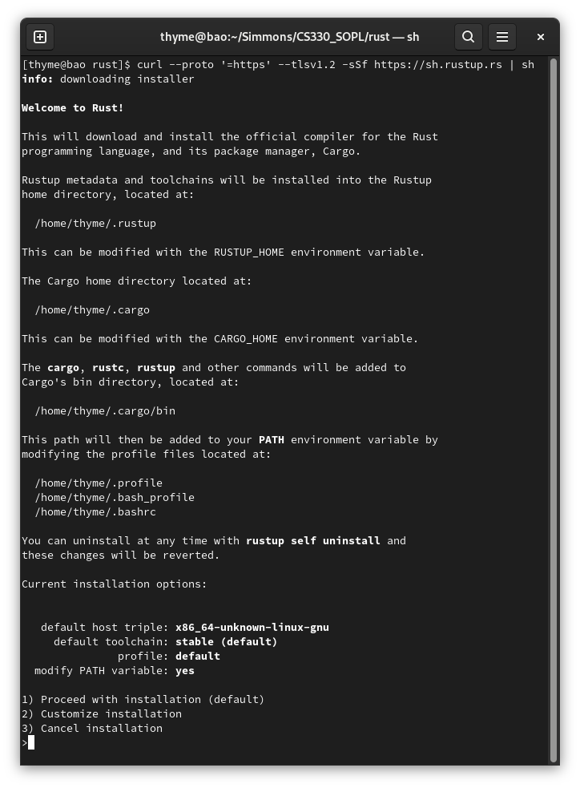
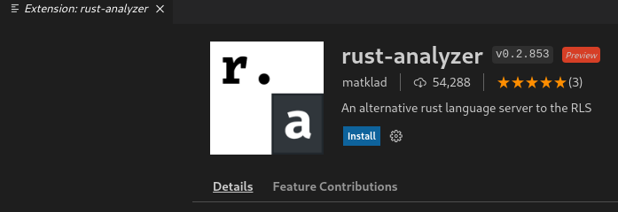
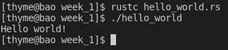

# Assignment 1: Language overview and setup

## History

**1. What is the name of your language?** 

I choose the programming language [Rust](https://www.rust-lang.org/). 

**2. When/where was it created, and by whom? Was it written to address a particular problem or need?**

Rust is a statically typed, systems programming language that is designed for performance and safety. Despite having no garbage collection, Rust enforces memory safety at compile time with a borrow checker. The borrow checker ensures that references only live as long as their data[^StackOverflow]. Unlike the languages of the C or C++, there is no worry of segfaults due to illegal memory access.

Rust was primarily designed by Graydon Hoare as a side project, and then became sponsored by Mozilla. The language addresses a need of "a safe, concurrent, practical systems language"[^RustFAQ]. 

**3. What types of programming is your language primarily used for (ex: web sites, videogames, mobile devices, parsing, etc.). If your language is multi-purpose, provide some examples of different projects it's been used for.**

Rust is a general purpose language, but it does have focuses. Rust is a good choice when you value both speed and reliability. Additionally, its great for low-level programming and having direct access to hardware. On the project's website, there are guides for command line, web assembly, networking, and embedded. According to JetBrains, about 49% of projects in Rust are command line tools. The next three biggest projects are systems programming, web development, and network programming[^JetBrains]. 

Rust is beginning to be more popular. There is a growing scene of game development[^RustGame]. One of the biggest Rust projects is currently Mozilla's Servo project, an embeddable web engine

**4. Where will you get information about this language when it's time to start programming in it? At the end of your assignment, provide a list of the names of books, website URLs, or any other resources that relate to your language in particular.**

Documentation comes built-in with Rust. The command `rustup doc` opens up an overview of the documentation of Rust, which is accessed on your browser without an internet connection. The page includes access to many of the resources listed below like *The Rust Programming Language*. 

I will use the following resources:
- [The Rust Programming Language by Steve Klabnik and Carol Nichols](https://doc.rust-lang.org/book/title-page.html)
- [The Rust Standard Library](https://doc.rust-lang.org/std/index.html)
- [Rust by Example](https://doc.rust-lang.org/rust-by-example/index.html)
- [GitHub Repo: rustlings](https://github.com/rust-lang/rustlings)
- [The Little Book of Rust Books](https://lborb.github.io/book/official.html)

## Getting Started

**1. What did you need to do to install the language?**

I installed Rust with Rustup, the Rust installer script. On my Linux computer, I ran the following command `curl --proto '=https' --tlsv1.2 -sSf https://sh.rustup.rs | sh` in the terminal. This command downloads the Rustup setup script off the internet with `curl`, and then pipes it to be run with the shell `sh`. Notice that the script provides an interactive menu. I chose the defaults, which installed the stable versions of Rust and Cargo, Rust's build tool and package manager.

The following changes happened to my computer.
- Installed the stable build of Cargo and Rust
    - Supporting commands were installed (cargo, rustc, rustup, rust-gdbm, rustdoc, etc.) 
- Added dotfiles to keep metadata (.rustup, .cargo)
- User PATH was changed in my profile files (.bashrc, .profile, .bash_profile)
    - PATH amended with `/home/thyme/.cargo/bin`
    - Allows easy access to Rust commands

Additionally, I installed the codium extension "rust-analyzer" to add language support to the IDE.

**2. Does this language come with a recommended programming environment? What is it? If not, how did you pick the one that you'll be using?**

The [Rust project](https://www.rust-lang.org/) doesn't have a recommended programming environment. The language is well supported with integrations in many editors. This includes VS Code, Atom, Emacs, Vim, Geany, and Sublime Text.[^Rust]. According to JetBrains, Visual Studio Code is the most popular editor for Rust with 40% programming in it[^JetBrains]. 

**3. How do you run programs in that language?**

First, you need to create a Rust program to run. Click the following link for a simple program: [hello_world.rs](hello_world.rs). The ".rs" extension distinguishes that the program is a Rust file. 

Then, you compile the Rust program with the Rust compiler, `rustc`. To use the `rustc`, you pass the name of the Rust file to be compiled as an argument.

After compiling, Rust outputs a binary executable that you can run. On Linux, I can run the file with the `./<executable>`.

See below for the terminal output of running the "hello world" program. 

**4. How do you write comments in your language?**

There are two types of comments in Rust, non-doc and doc comments. 

Non-doc comments are either single line or multi-line comments. Single line comments are formed with two forward slashes like `//`. Multi-line or block comments start with a `/*` and end with a `*/`[^RustComments]. Comments can be placed at the beginning or end of lines. While multi-line comments can span multiple lines, single line comments may only take up one line at most. 

Doc comments are special type of comments that are interpreted as syntax for `rustdoc` attributes. Doc comments create documentation for code[^RustDocumentation]. This is helpful when you publish your code as packages and share them with others on [crates.io](https://crates.io/). Doc comments begin with three forward slashes like `///`. There are also other supporting styles of doc comments like `//!`. 

### References 

[^JetBrains]: ["The State of Developer Ecosystem 2021: Rust Survey,"](https://www.jetbrains.com/lp/devecosystem-2021/rust/) JetBrains. https://www.jetbrains.com/lp/devecosystem-2021/rust (Accessed May 23, 2022)
[^Rust]: ["Rust project Tools,"](https://www.rust-lang.org/tools) rust-lang.org. https://www.rust-lang.org/tools (Accessed May 23, 2022)
[^RustComments]: ["The Rust Programming Language 3.4 Comments.,"](https://doc.rust-lang.org/book/ch03-04-comments.html) docs.rust-lang.org. https://doc.rust-lang.org/book/ch03-04-comments.html (Accessed May 23, 2022)
[^RustDocumentation]: ["The Rust Programming Language 14.2 Plushing a Crate to Crates.io.,"](https://doc.rust-lang.org/book/ch14-02-publishing-to-crates-io.html#making-useful-documentation-comments) docs.rust-lang.org. https://doc.rust-lang.org/book/ch14-02-publishing-to-crates-io.html#making-useful-documentation-comments (Accessed May 23, 2022)
[^RustFAQ]: ["FAQ - Rust Project."](https://web.archive.org/web/20160609195720/https://www.rust-lang.org/faq.html#project) rust-lang.org. https://web.archive.org/web/20160609195720/https://www.rust-lang.org/faq.html#project (Accessed May 23, 2022)
[^RustGame]: ["Rust: Are we game yet?"](https://arewegameyet.rs/) Arewegameyet? https://arewegameyet.rs (Accessed May 23, 2022)
[^StackOverflow]: J. Goulding, ["The Overflow: What is Rust and why is it so popular?"](https://stackoverflow.blog/2020/01/20/what-is-rust-and-why-is-it-so-popular/) Stack Overflow. https://stackoverflow.blog/2020/01/20/what-is-rust-and-why-is-it-so-popular/ (Accessed May 23, 2022)