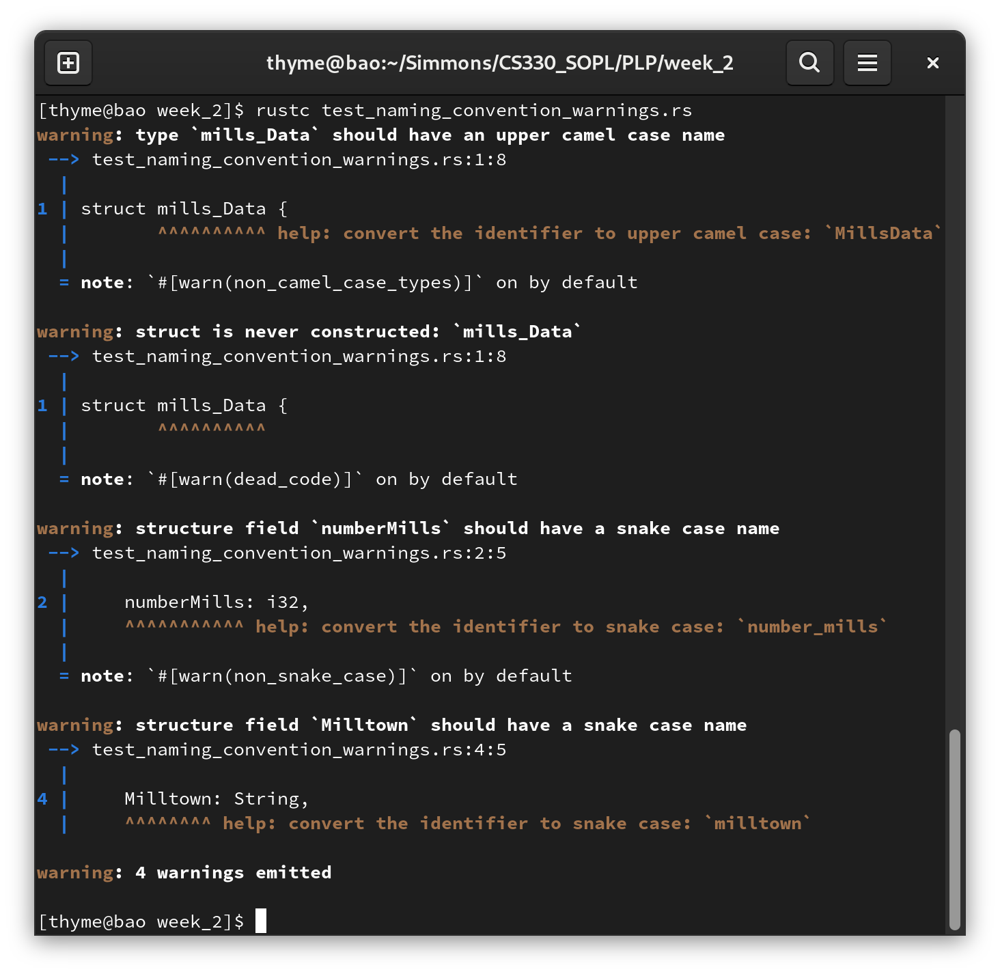
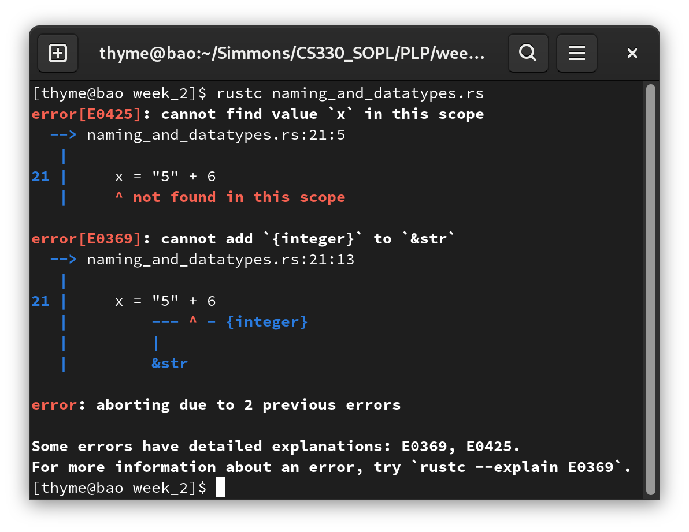

# Assignment 2: Data types and naming conventions

## Discussion Questions

**1. What are the naming requirements for variables in your language?**

Variables can have numbers, letters, and underscores. Variables cannot begin with a number. 

Rust is case sensitive so a variable called "foo" is not the same as a variable called "Foo". 

Reserved keywords cannot be used as identifiers. Keywords can either be implemented in Rust, or reserved for future use. Although you cannot directly use a keyword like `move` as an identifier, you can use the keyword with a prefix. Rust allows for raw identifiers. This lets you use keywords if you prefix them with a `r#` [^ReservedKeywords].

**1a. What about naming conventions? Are they enforced by the compiler/interpreter, or are they just standards in the community?**

Naming conventions are enforced by the compiler with warnings. The following code may be valid, but it doesn't conform to Rust's guidelines. 

``` rust 
struct mills_Data {
    numberMills: i32,
    millowner: String, 
    Milltown: String,
}
```

The guidelines specify that "type-level" constructs should be UpperCamelCase and variables or "value-level" constructs should be snake_case [^NamingConventions]. The "mills_Data" is a struct type with snake case, *but* it should be CamelCase. The variables are in CamelCase, *but* should be in snake_case. When we compile (`rustc`) or check or code (`crate check`), Rust will show warnings about not conforming to naming conventions.



The following code will *not* generate warnings based on naming conventions.

``` rust
struct MillsData {
    number_mills: i32,
    mill_owner: String, 
    mill_town: String,
}
```

**2. Is your language statically or dynamically typed?**

Rust is statically typed language. The types of all variables must be known at compiler time. 

Can you change a variable type later? Yes, but you have to be mindful about ownership! You can use variable shadowing with the `let` keyword.

**3. Strongly typed or weakly typed?**

Rust is a strongly typed language. You must work along the constraints of the type. 

**4. If you put this line `x = "5" + 6` (or something similar) in a program and try to print x, what does it do? If it doesn't compile, why? Is there something you can do to make it compile?**

The code `x = "5" + 6` will not compile in Rust. The compiler will show the following errors. 



The solution is to fix "5". The "5" is a literal string. We need to convert it into a String. Then, we have to parse it into a i32. Finally, we have to unwrap the result. 

The following code will compile:
`let x = "5".to_string().parse::<i32>().unwrap() + 6;`

Note that we don't need to initialize the variable `x` or the value 6 as a i32 int. This is because i32 is the default type for integers. 

**5. Describe the limitations (or lack thereof) of your programming language as they relate to the coding portion of the assignment (adding ints and floats, storing different types in lists, converting between data types). Are there other restrictions or pitfalls that the documentation mentions that you need to be aware of?**

Rust variables cannot be rewritten at default. Instead, they are assigned a computed value at runtime and are read-only by default. You can make Rust variables mutable with a explicit `mut` keyword. 

- Rust arrays *must* be of the same type 
- By default, you cannot do math on floats and ints
- Converting is hard. You can use `as`, `from`, or `into` but it depends on the type. There is different handling whether or not the type is stored on the stack or the heap.
- Using variables in functions is different than other languages. You need to know the difference of what happens when you pass in a variable or a reference.
- Variables have scope, lifetimes, and visibility 

**6. Are there built-in complex data types that are commonly used in your language? (hint: they’d probably appear fairly early in the documentation if so)**

According to the Rust Documentation[^RustDocumentation], the following are the built-in types. 

Primitive types:
- Boolean
- Numeric
- Textual (char, str)
- Never 

Sequence types:
- Tuple
- Array
- Slice 

User-defined types:
- Struct
- Enum
- Union

Function types:
- Functions
- Closures

Pointer types:
- References
- Raw pointers
- Function pointers

Trait types:
- Trait objects
- Impl trait

Many people use the struct and enum types to represent classes that you might see in object oriented languages (eg. Java). Like class methods, you can define implementation functions for the struct. 

Tuples are common because they allow for multiple different kinds of data types in one variable. Tuples are not just essential for their own use and design. Tuples are used for returning multiple values from a function. As far as I know, they're the only way of deconstructing.

### References 

[^DataTypes]: ["Data Types,"](https://doc.rust-lang.org/book/ch03-02-data-types.html) docs.rust-lang.org. https://doc.rust-lang.org/book/ch03-02-data-types.html (Accessed May 31, 2022)
[^NamingConventions]: ["Naming Conventions,"](https://doc.rust-lang.org/1.0.0/style/style/naming/README.html) doc.rust-lang.org. https://doc.rust-lang.org/1.0.0/style/style/naming/README.html (Accessed May 31, 2022)
[^RustReservedKeywords]: ["Keywords,"](https://doc.rust-lang.org/reference/keywords.html) doc.rust-lang.org. https://doc.rust-lang.org/reference/keywords.html (Accessed Aug 19, 2022)
[^RustDocumentation]: ["Types,"](https://doc.rust-lang.org/reference/types.html) docs.rust-lang.org. https://doc.rust-lang.org/reference/types.html (Accessed Aug 19, 2022)