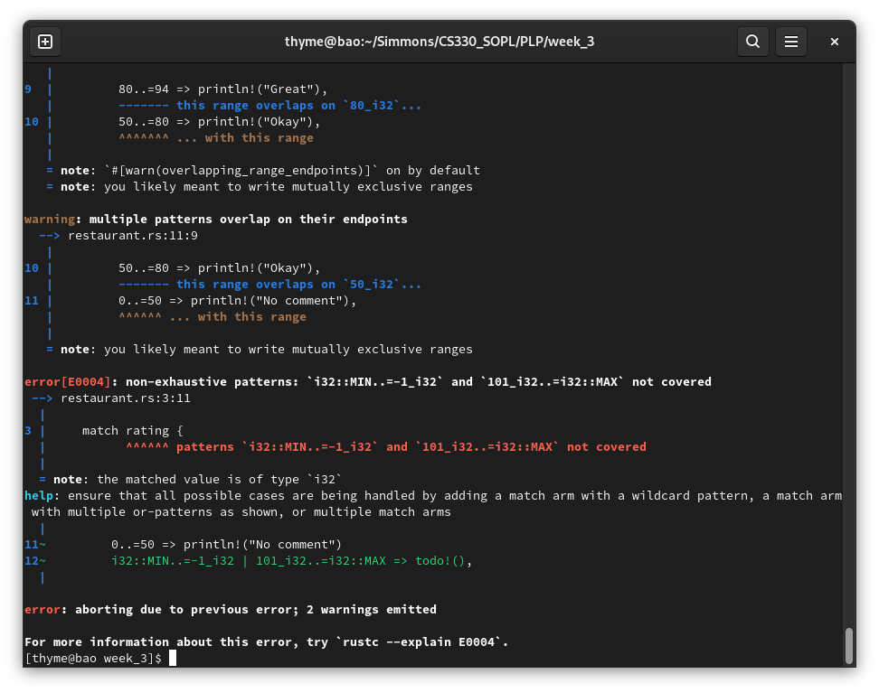

# Assignment 3: If/else, switch, logical operators

## Discussion Questions

**1. What are the boolean values in your language? (e.g., True and False, true and false, 1, and 0, etc)**

The boolean type `bool` represents a value that can only be `true` or `false`. The bool type can be casted to a integer. If so, the `true` is 1 and `false` is 0 [^PrimitiveTypebool].

**2. What types of conditional statements are available in your language? (if/else, if/then/else, if/elseif/else). Does your language allow for statements other than “if” (for example, Perl has an “unless” statement, which does the opposite of “if”!)**

The following conditional statements are available: 
- while
- loop 
- if
- if/else
- if/elseif/else
- match 
- if let
- while let 

Most Rust conditionals work similar to other languages. The "while" and "loop" will run repeatedly until stopped with a condition or `break`. The "if" and "else" will evaluate a code block based on a boolean condition. 

Why are there conditionals with the "let" keyword? This is so that we can conditionally assign a value of a variable. In order to use "if let" or "while let", we need to have two things. First, we need to have both a "if" and a "else" statement. Second, the expressions must also provide a value to be assigned. 

``` rust 
let can_drive = if is_of_age {
    true
} else {
    false
};
```

Note that the variable `can_drive` must be a type bool. All conditional statements _must_ return the same type. Also, note that there is no "return" statement after the "if" or "else". This is because the line is an expression. Expressions return values. 

The "while let" is an interesting conditional statement that can pattern match [^WhileLet]. 

`assert!` is not part of flow control. However, it is still an important macro that can use the `bool` type in testing conditions.

For examples of conditional statements: 
- [if_else.rs](if_else.rs)
- [meaning_of_life.rs](meaning_of_life.rs)
- [bool_usage.rs](bool_usage.rs)

**3. Does your language use short-circuit evaluation? Include an example of the short-circuit logic working or not working (or both, if your language is like Java and supports both!)**

Rust has short circuit operators: `&&` and `||`.

``` rust
// Will short circuit! If you don't have a car, it doesn't matter what age you are.
// Won't evaluate the righthand.
let has_car: bool = false;
let can_drive = has_car && is_of_age;

// Will definitely panic here. Because you don't have a car, you'll try to evaluate the righthand
// Will evaluate the righthand.
let can_drive = has_car || panic!(); 
```

Here is an example for the code that will panic because of short circuiting: [car_panic.rs](car_panic.rs)

There are not ternary operators like in C. However, you can still do one-liners or complex code without it. This is thanks to code blocks. 

What if you wanted to do something like `if birthday == 16 ? true : false` ? 

The equivalent would be `if birthday == 16 {true} else {false}`

What if you use only one "&" or "|"? You get bitwise operators:
- Bitwise AND (&)
- Bitwise OR (|)
- Bitwise XOR (^)
- Bitwise NOT (!)
- Left Shift (<<)
- Right Shift (>>)

It is important to recognize that the ampersand "&" is also used to denote references. If you see a ampersand prefixed to a variable name, it probably is a reference to the variable. 

**4. How does your programming language deal with the “dangling else” problem?**

The "dangling else" is a problem that happens when parenthesis around conditions are mandatory and braces are optional. 

Braces being optional makes it confusing to figure out what the program execution should be. For instance, what should the below be in Java?

``` java 
if (conditional)
    if (conditional2)
        System.out.println("inside second conditional");
        ...
    else
        System.out.println("else happened");
        ...
```

Should the `else` be outer or inner? When will it execute? When the first `if` fails or when the second `if` fails?

The result is ambiguous. And, the reason why is because Java doesn't mind indentation and doesn't require braces to denote blocks. 

Rust doesn't have this issue. There's no rule to associate the `else` with the right `if`. However, braces are mandatory in any `if/else/else if` branches. The braces make it easy to organize and see exactly what the control flow will be.

``` rust
if conditional {
    if conditional2 {
        println!("inside second conditional");
    }
} 
else {
    println!("else happened");
}
```

**5. If your language supports switch or case statements, do you have to use “break” to get out of them? Can you use “continue” to have all of them evaluated?**

Rust supports `match`, which matches a pattern. You can use different ways of matching. For instance, you can match a single value, several, or even a range [^RustMatch]. 

By default, you don't need to use a "break" or "continue" in the `match` control structure. If you wanted to do something like that, you can wrap the `match` in a `loop`. However, it could become confusing and thus bad code. See below my attempt.

``` rust 
loop { match age {
    99 => {
        let can_be_wizard = true;
        if can_be_wizard == 1 { break; }
    },
    _ => {} 
} break; }
```

Unlike in other languages, a `match` in Rust must cover _all_ possible cases. For example, if you are matching a u8 integer, you will need to have a match for any value it could be. This would be from its minimum (0) to its a maximum value of 255. You can have a default match case, which is denoted by "_". 

If you don't handle a case, Rust will not be able to compile the code!



See the [restaurant.rs](restaurant.rs) code for an example of using `match`. 

### References 

[^PrimitiveTypebool]: , ["Primitive Type bool,"](https://doc.rust-lang.org/std/primitive.bool.html) docs.rust-lang.org. https://doc.rust-lang.org/std/primitive.bool.html (Accessed June 27, 2022)
[^WhileLet]: , ["while let,"](https://doc.rust-lang.org/rust-by-example/flow_control/while_let.html) doc.rust-lang.org. https://doc.rust-lang.org/rust-by-example/flow_control/while_let.html (Accessed August 20, 2022)
[^ForLoops]: , ["for loops,"](https://doc.rust-lang.org/rust-by-example/flow_control/for.html) doc.rust-lang.org. https://doc.rust-lang.org/rust-by-example/flow_control/for.html (Accessed August 20, 2022)
[^RustMatch]: , ["match,"](https://doc.rust-lang.org/rust-by-example/flow_control/match.html) doc.rust-lang.org. https://doc.rust-lang.org/rust-by-example/flow_control/match.html (Accessed August 20, 2022)